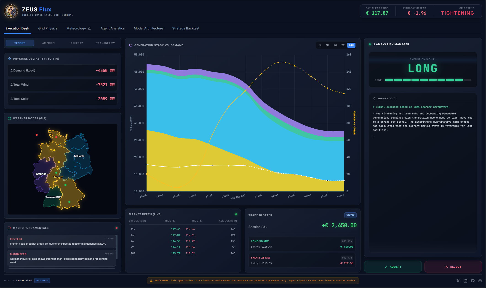
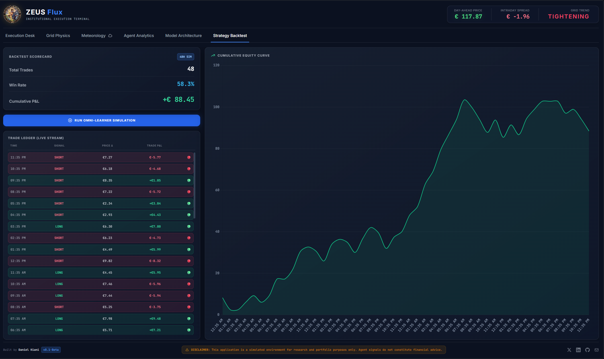
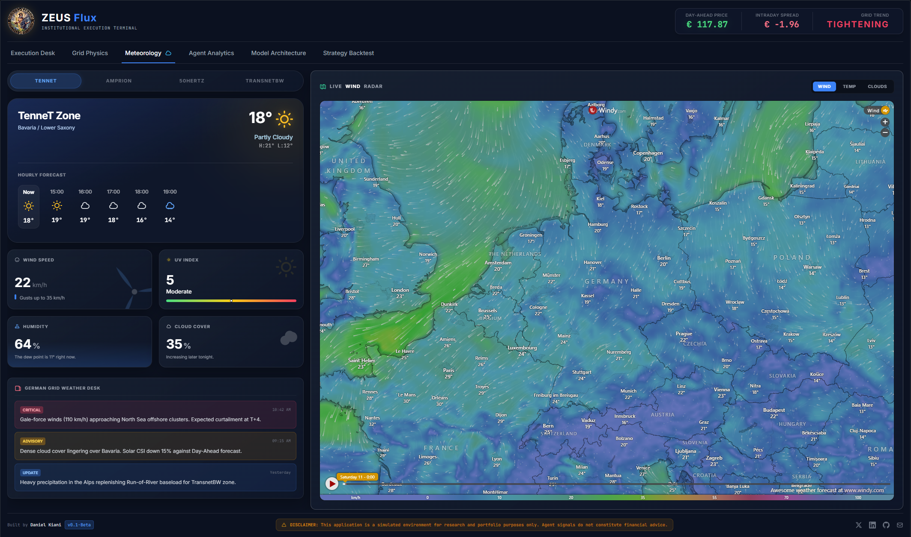

<div align="center">
  
  <h1>ZEUS Flux</h1>
  <p><b>Institutional Execution Terminal for Renewable Energy Trading</b></p>
  
  
  
  
</div>

## 📖 Overview

ZEUS Flux is a full-stack, AI-powered quantitative trading terminal designed to forecast short-term energy generation and predict intraday market price pressures across the German electrical grid. By combining a multi-model machine learning pipeline with a Large Language Model (Llama-3) acting as an autonomous Risk Manager, ZEUS Flux bridges the gap between raw physical grid data and macroeconomic context.

### 🗺️ Current Scope & Roadmap (v0.1.0-Beta)

The terminal's underlying architecture is designed to model the entire German electrical grid. However, for this initial `v0.1.0-Beta` deployment, live execution and data ingestion are exclusively focused on the **TenneT** regional transmission zone as a production Minimum Viable Product (MVP). Full spatial integration for the remaining grid operators (Amprion, 50Hertz, and TransnetBW) will be developed and slated for upcoming releases.

### The Journey: From Research to Production

This project is the production-ready evolution of my earlier machine learning research repository, [renewable_energy_forecast](https://github.com/danielkiani/renewable_energy_forecast).

While the original repository focused heavily on exploratory data analysis, Jupyter notebooks, and baseline model evaluation, ZEUS Flux represents the deployment phase. It takes the winning predictive models from that research—specifically the Spatial Omni-Learner Architecture—and packages them into a resilient backend API and a premium, responsive frontend dashboard inspired by institutional software like Bloomberg Terminal.

## 🧠 Architecture & Data Pipeline

### 1. Data Fetching & Ingestion

The terminal relies on high-fidelity, real-time data orchestrated by `ingest_regional.py`:

* **Grid Telemetry:** Pulls live physical grid data (load, wind, solar, biomass, and hydro generation) directly from the **SMARD API** (Bundesnetzagentur).

* **Meteorological Nodes:** Integrates regional weather data mapped directly to the four transmission zones (TenneT, Amprion, 50Hertz, TransnetBW) to anticipate renewable generation drop-offs or surges.
* **Automated Preprocessing:** The ingestion script handles missing values, cyclic time-encoding, and rolling lag generation automatically before passing the array to the inference engine.

### 2. The V14 Spatial Omni-Learner

The backend prediction engine relies on a sophisticated ensemble pipeline:

* **Spatial Grid Parsing:** The German grid is divided into its core regional transmission operators.

* **Expert Sub-Models:** 7 isolated XGBoost expert trees and a PyTorch `RegionalLSTMLightning` neural network process regional telemetry.
* **The Meta-Learner:** A LightGBM Omni-Learner evaluates the sub-models to correct base errors, achieving ~1.5 GW error metric.

### 3. LLM Risk Manager

A localized Llama-3 instance intercepts the quantitative signals. It merges the physical grid math with a simulated live macroeconomic news feed (capturing geopolitical events or sudden reactor outages) and returns strict, structured JSON reasoning to approve or reject the trade.

## ✨ Features

### 1. The Execution Desk & LLM Risk Manager

The main trading hub. Displays physical deltas, simulated order books, and the Llama-3 Risk Manager's real-time reasoning for LONG/SHORT signals based on grid math and breaking news.



### 2. Strategy Backtest Suite

A rigorous historical backtesting environment featuring a cumulative equity curve (Chart.js), a live-streaming trade ledger, and a scorecard detailing win rates and total P&L.


### 3. Dynamic Meteorology & Grid Radar

A highly dynamic weather dashboard featuring animated UI widgets, regional switching that binds data to specific grid zones (e.g., TenneT), and an embedded Windy.com live interactive radar.


### 4. Agent Analytics

Dive deep into the autonomous decision-making engine. This tab provides transparency into the Omni-Learner's confidence thresholds, feature importance, and how the models weigh physical grid math to finalize a quantitative trading signal.


## 🛠️ Tech Stack

* **Frontend:** HTML5, Tailwind CSS, JavaScript (Vanilla), Chart.js
* **Backend:** Python, FastAPI, Uvicorn
* **Machine Learning:** PyTorch (Lightning), XGBoost, LightGBM, Optuna
* **AI / NLP:** Llama-3 (Local inference), Regex/JSON parsing

## 📂 Repository Structure

```text
zeus-flux-terminal/
├── assets/
│   └── zeus.png                 # App logo and UI assets
├── data/                        # Processed regional telemetry
├── src/
│   ├── backend_server.py        # FastAPI server & LLM integration
│   ├── ingest_regional.py       # Unified SMARD & Weather scraper
│   ├── train_regional_stacked.py# PyTorch LSTM & XGBoost experts
│   ├── meta_learner.py          # LightGBM Omni-Learner
│   ├── evaluate_regional.py     # Error metric scoring
│   ├── agent_trader.py          # Signal generation & LLM prompt builder
│   ├── backtest_agent.py        # Historical P&L simulation engine
│   └── hyperparameter_regional.py # Optuna tuning script
├── zeus_dashboard.html          # Main frontend terminal UI
└── README.md
```

## 🚀 Getting Started

### Prerequisites

* Python 3.10+
* Local Llama-3 instance running on port 11434 (optional, includes fallback simulation mode)

### Installation

**1. Clone the repository**

```bash
git clone [https://github.com/danielkiani/zeus-flux-terminal.git](https://github.com/danielkiani/zeus-flux-terminal.git)
cd zeus-flux-terminal
```

**2. Set up a Virtual Environment (Recommended)**
Creating a virtual environment ensures that the dependencies for this project do not conflict with your global Python packages.

* **On macOS/Linux:**

  ```bash
  python3 -m venv venv
  source venv/bin/activate
  ```

* **On Windows:**

  ```bash
  python -m venv venv
  venv\Scripts\activate
  ```

**3. Install dependencies**

```bash
pip install -r requirements.txt
```

**4. Start the backend server**

```bash
cd src
python backend_server.py
```

**5. Launch the terminal**
Simply open `zeus_dashboard.html` in any modern web browser.

## ⚖️ Disclaimer

**⚠️ Simulated environment for research purposes only. Agent signals and predictive models do not constitute financial advice. Execution at own risk.⚠️**